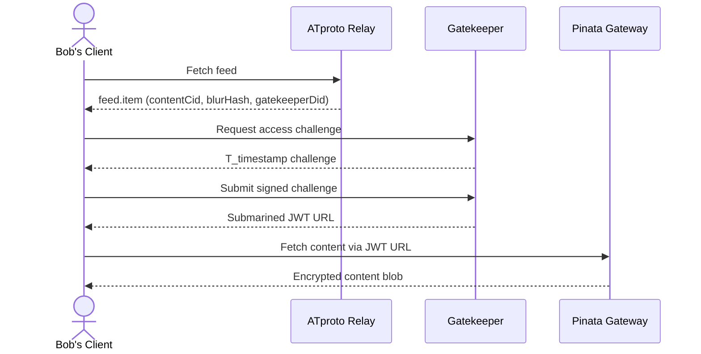

# Traiforce-Lexicon

> The Trinity of data access and privacy 🔏

**Traiforce-Lexicon** is the official repository of [ATproto](https://atproto.com/) lexicon definitions for the **Traiforce Protocol** — a decentralized layer for private, gated content built on top of the AT Protocol and [IPFS](https://ipfs.tech/) (via [Pinata](https://www.pinata.cloud/)).

---

## What is the Traiforce Protocol?

Traiforce enables creators to publish encrypted, subscriber-only content on the open AT Protocol network. It uses a **three-layer architecture** to separate public discovery metadata, private encrypted content, and access coordination:

| Layer | Technology | Responsibility |
|---|---|---|
| **Public Layer** | ATproto PDS | Social metadata, discovery pointers, grant records |
| **Encrypted / Gated Layer** | IPFS via Pinata | Encrypted content blobs, private profile vaults |
| **Coordination Layer** | Gatekeeper | Validates grants, signs identities, issues JWT URLs |


---

## Lexicon Definitions

This repository defines three ATproto lexicon records in the `net.traiforce` namespace.

### `net.traiforce.actor.profile`

Defines a user's presence on the Traiforce network.

| Field | Type | Description |
|---|---|---|
| `displayName` | string | Public-facing teaser name visible to all ATproto users |
| `vaultCid` | string | IPFS CID pointing to the user's encrypted full profile JSON blob |
| `gatewayUrl` | uri | Address of the user's dedicated Pinata Gateway |

### `net.traiforce.feed.item`

A gated content pointer with a safe public preview.

| Field | Type | Description |
|---|---|---|
| `contentCid` | string | IPFS hash of the encrypted content (requires authorization to access) |
| `blurHash` | string | BlurHash representation for safe, low-fidelity public previews |
| `gatekeeperDid` | did | DID of the Gatekeeper service clients must contact to obtain access |

### `net.traiforce.actor.grant`

An Access Control List (ACL) entry that authorizes a specific user to access gated content.

| Field | Type | Description |
|---|---|---|
| `subjectDid` | did | DID of the user being granted access |
| `issuerDid` | did | DID of the content creator issuing the grant |
| `signature` | string | Cryptographic signature from `issuerDid` verifying the grant |
| `expiry` | datetime? | Optional expiration timestamp; enforced by the Gatekeeper on every handshake |

---

## Access Workflow

The following is a high-level summary of how a subscriber accesses gated content.



See [`docs/architecture/03-access-workflow.md`](./docs/architecture/03-access-workflow.md) for the full step-by-step sequence.

---

## Repository Structure

```
Traiforce-Lexicon/
├── lexicons/
│   └── net/
│       └── traiforce/
│           ├── actor/
│           │   ├── profile.json     # net.traiforce.actor.profile
│           │   └── grant.json       # net.traiforce.actor.grant
│           └── feed/
│               └── item.json        # net.traiforce.feed.item
└── docs/
    └── architecture/
        ├── 01-protocol-architecture.md
        ├── 02-lexicon-specifications.md
        ├── 03-access-workflow.md
        ├── 04-security-privacy.md
        └── 05-system-overview.md
```

---

## Documentation

Full architecture documentation is available in [`docs/architecture/`](./docs/architecture/):

- [01 – Protocol Architecture](./docs/architecture/01-protocol-architecture.md) — Tripartite Data Model
- [02 – Lexicon Specifications](./docs/architecture/02-lexicon-specifications.md) — Core record definitions
- [03 – Access Workflow](./docs/architecture/03-access-workflow.md) — End-to-end content access sequence
- [04 – Security & Privacy](./docs/architecture/04-security-privacy.md) — Blinded interactions and content revocation
- [05 – System Overview](./docs/architecture/05-system-overview.md) — High-level component diagram

---

## Contributing

Contributions are welcome! Please read [CONTRIBUTING.md](./CONTRIBUTING.md) for guidelines on how to propose changes, report issues, and submit pull requests.

---

## License

This project is licensed under the [MIT License](./LICENSE).

