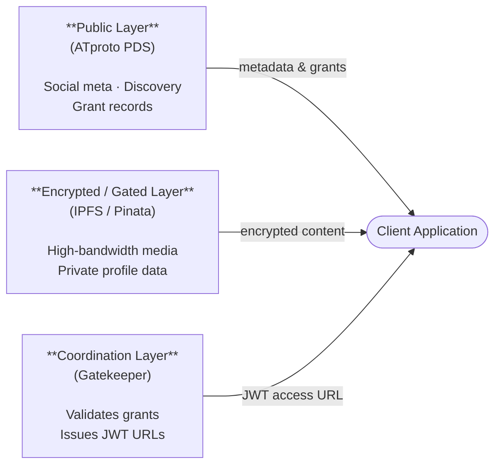
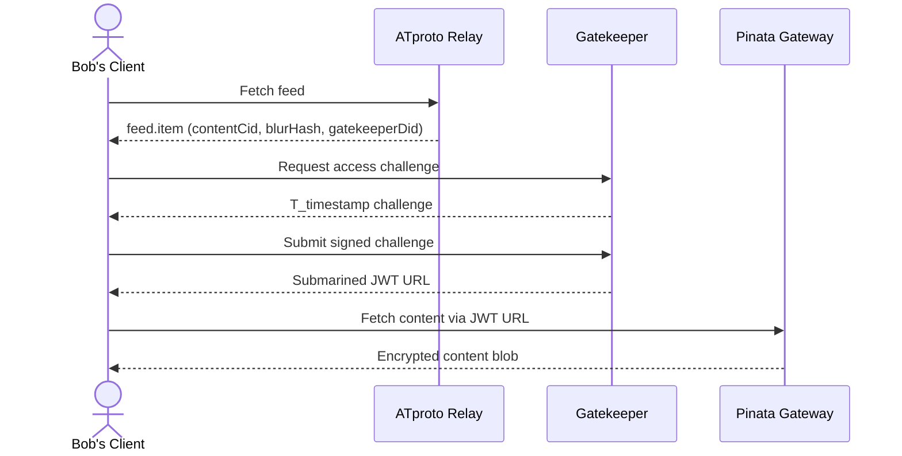

# Traiforce-Lexicon

> The Trinity of data access and privacy 🔏

**Traiforce-Lexicon** is the official repository of [ATproto](https://atproto.com/) lexicon definitions for the **Traiforce Protocol** — a decentralized layer for private, gated content built on top of the AT Protocol and [IPFS](https://ipfs.tech/) (via [Pinata](https://www.pinata.cloud/)).

---

## What is the Traiforce Protocol?

Traiforce enables creators to publish encrypted, subscriber-only content on the open AT Protocol network. It uses a **three-layer architecture** to separate public discovery metadata, private encrypted content, and access coordination:

| Layer | Technology | Responsibility |
|---|---|---|
| **Public Layer** | ATproto PDS | Social metadata, discovery pointers, grant records |
| **Encrypted / Gated Layer** | IPFS via Pinata | Encrypted content blobs, private profile vaults |
| **Coordination Layer** | Gatekeeper | Validates grants, signs identities, issues JWT URLs |



---

## Lexicon Definitions

This repository defines three ATproto lexicon records in the `net.traiforce` namespace.

### `net.traiforce.actor.profile`

Defines a user's presence on the Traiforce network.

| Field | Type | Description |
|---|---|---|
| `displayName` | string | Public-facing teaser name visible to all ATproto users |
| `vaultCid` | string | IPFS CID pointing to the user's encrypted full profile JSON blob |
| `gatewayUrl` | uri | Address of the user's dedicated Pinata Gateway |

### `net.traiforce.feed.item`

A gated content pointer with a safe public preview.

| Field | Type | Description |
|---|---|---|
| `contentCid` | string | IPFS hash of the encrypted content (requires authorization to access) |
| `blurHash` | string | BlurHash representation for safe, low-fidelity public previews |
| `gatekeeperDid` | did | DID of the Gatekeeper service clients must contact to obtain access |

### `net.traiforce.actor.grant`

An Access Control List (ACL) entry that authorizes a specific user to access gated content.

| Field | Type | Description |
|---|---|---|
| `subjectDid` | did | DID of the user being granted access |
| `issuerDid` | did | DID of the content creator issuing the grant |
| `signature` | string | Cryptographic signature from `issuerDid` verifying the grant |
| `expiry` | datetime? | Optional expiration timestamp; enforced by the Gatekeeper on every handshake |

---

## Access Workflow

The following is a high-level summary of how a subscriber accesses gated content.



See [`docs/architecture/03-access-workflow.md`](./docs/architecture/03-access-workflow.md) for the full step-by-step sequence.

---

## Repository Structure

```
Traiforce-Lexicon/
├── lexicons/
│   └── net/
│       └── traiforce/
│           ├── actor/
│           │   ├── profile.json     # net.traiforce.actor.profile
│           │   └── grant.json       # net.traiforce.actor.grant
│           └── feed/
│               └── item.json        # net.traiforce.feed.item
└── docs/
    └── architecture/
        ├── 01-protocol-architecture.md
        ├── 02-lexicon-specifications.md
        ├── 03-access-workflow.md
        ├── 04-security-privacy.md
        └── 05-system-overview.md
```

---

## Integrating with Traiforce

This section is aimed at third-party developers who want to consume Traiforce lexicons within their own AT Protocol applications.

### Code Generation

Use [`@atproto/lex-cli`](https://www.npmjs.com/package/@atproto/lex-cli) to generate TypeScript types directly from the `.json` definitions in the `/lexicons` folder:

```bash
npx @atproto/lex-cli generate-api \
  --lexicon-dir ./lexicons \
  --out-dir ./src/generated
```

This produces strongly-typed TypeScript interfaces and `isRecord` helper functions for every lexicon defined under `net.traiforce`.

### Detection Logic

Once types are generated, use the `isRecord` helpers to identify `net.traiforce.feed.item` records as they arrive from a PDS repository export or a Firehose subscription:

```typescript
import { isRecord as isFeedItem } from './generated/types/net/traiforce/feed/item';

function processFirehoseRecord(record: unknown): void {
  if (isFeedItem(record)) {
    console.log('Feed item detected:', record.contentCid);
    console.log('Gatekeeper DID:', record.gatekeeperDid);
    // Route to access-request flow…
  }
}
```

> **Tip:** When subscribing to the AT Protocol Firehose (`com.atproto.sync.subscribeRepos`), inspect `op.payload` from each `#commit` event and pass it through `isFeedItem` to filter Traiforce content without any manual `$type` string comparisons.

### The Private Like Standard

`net.traiforce.graph.privateLike` records encode a privacy-preserving signal: a user's appreciation of a piece of content without revealing the target publicly. Verification works as follows:

1. **Inputs** — the `contentUri` of the liked item and the `creatorDid` of the user who issued the like.
2. **Salt derivation** — treat `creatorDid` as a UTF-8 salt string.
3. **Hash** — compute `SHA-256(contentUri + "|" + creatorDid)` and encode the result as a lowercase hex string. The `|` delimiter prevents length-extension collisions between the two inputs.
4. **Compare** — the computed hash must equal the `hash` field stored in the record.

```typescript
import { createHash } from 'node:crypto';

function verifyPrivateLike(
  contentUri: string,
  creatorDid: string,
  recordHash: string,
): boolean {
  const expected = createHash('sha256')
    .update(`${contentUri}|${creatorDid}`, 'utf8')
    .digest('hex');
  return expected === recordHash;
}

// Example usage
const isValid = verifyPrivateLike(
  'at://did:plc:abc123/net.traiforce.feed.item/3jui7kd52c200',
  'did:plc:creator456',
  '<hash field from the privateLike record>',
);
```

> **Note:** The `creatorDid` acts as a per-user salt so that the same `contentUri` produces a different hash for every user, preventing trivial cross-user correlation of private likes.

### Pinata Gateway Logic

Media stored under a `net.traiforce.feed.item` record is encrypted and hosted on IPFS via a private Pinata Gateway. Clients **cannot** access content directly with the `contentCid` alone.

To retrieve media:

1. Read the `gatekeeperDid` field from the `net.traiforce.feed.item` record.
2. Resolve the Gatekeeper's service endpoint by fetching and parsing its DID document (e.g., via `https://plc.directory/<did>` for `did:plc` DIDs or the `.well-known/did.json` path for `did:web` DIDs) and extracting the appropriate `#atproto_pds` or custom service entry.
3. Complete the challenge–response handshake (see [Access Workflow](./docs/architecture/03-access-workflow.md)) to receive a **signed JWT URL** scoped to the requested CID.
4. Use the JWT URL to fetch the encrypted blob directly from the Pinata Gateway — no additional credentials are required once you hold the URL.

The JWT URL is short-lived and single-use; clients should not cache or share it.

---

## Documentation

Full architecture documentation is available in [`docs/architecture/`](./docs/architecture/):

- [01 – Protocol Architecture](./docs/architecture/01-protocol-architecture.md) — Tripartite Data Model
- [02 – Lexicon Specifications](./docs/architecture/02-lexicon-specifications.md) — Core record definitions
- [03 – Access Workflow](./docs/architecture/03-access-workflow.md) — End-to-end content access sequence
- [04 – Security & Privacy](./docs/architecture/04-security-privacy.md) — Blinded interactions and content revocation
- [05 – System Overview](./docs/architecture/05-system-overview.md) — High-level component diagram

---

## Contributing

Contributions are welcome! Please read [CONTRIBUTING.md](./CONTRIBUTING.md) for guidelines on how to propose changes, report issues, and submit pull requests.

---

## License

This project is licensed under the [MIT License](./LICENSE).

