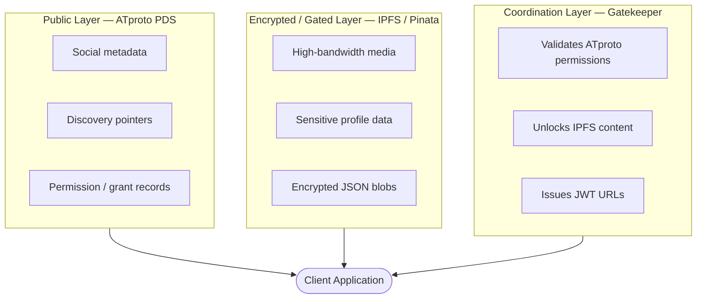
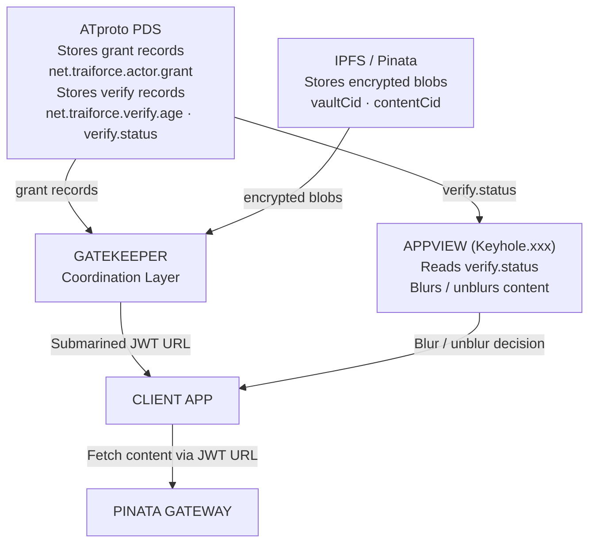

# 01 – Protocol Architecture

## Tripartite Data Model

Traiforce operates on a three-layer architecture where each layer has a distinct responsibility.

## Layer Descriptions

### Public Layer – ATproto PDS

The **Public Layer** lives in the user's Personal Data Server (PDS) on the AT Protocol network.

- **Responsibility**: Store discoverable, public-facing metadata and access-control records.
- **Data types**:
  - Social metadata (display names, avatars, public bios)
  - Discovery pointers referencing encrypted IPFS content
  - Permission/grant records that authorize other users
  - Age-verification records (`verify.age`, `verify.status`) without PII
- **Visibility**: Readable by the AT Protocol Relay network and any client.

### Encrypted / Gated Layer – IPFS via Pinata

The **Encrypted/Gated Layer** stores the actual private content off-chain using IPFS, hosted and pinned through Pinata.

- **Responsibility**: Host high-bandwidth media and sensitive profile information.
- **Data types**:
  - Encrypted JSON blobs (full profile vault)
  - Private images, video, and other media files
- **Access**: Content is only retrievable via Submarined JWT URLs issued by the Gatekeeper.

### Coordination Layer – Gatekeeper

The **Coordination Layer** (Gatekeeper) is a decentralized sidecar service that bridges ATproto permissions with IPFS content delivery.

- **Responsibility**: Authenticate clients, verify on-chain grant records, and provision temporary access URLs.
- **Key operations**:
  1. Receive client access requests
  2. Verify `net.traiforce.actor.grant` records on ATproto
  3. Validate client identity signatures
  4. Use the creator's Pinata API Key to generate Submarined JWT URLs

## Layer Interactions

