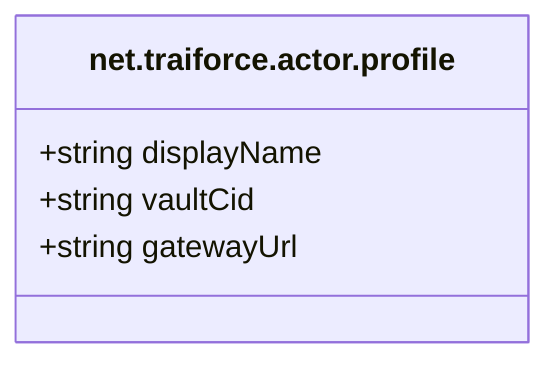
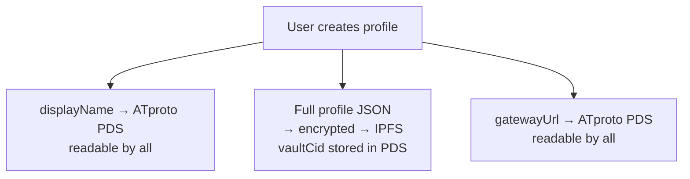
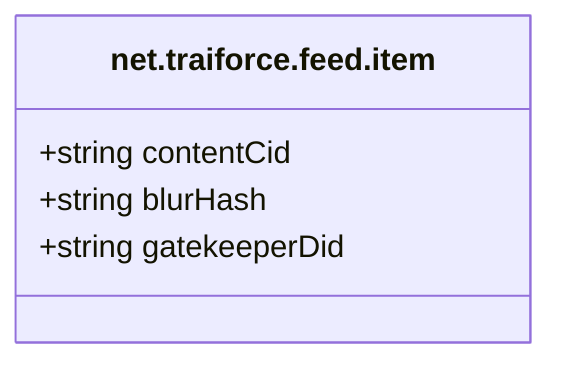
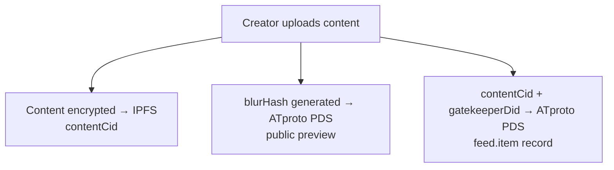
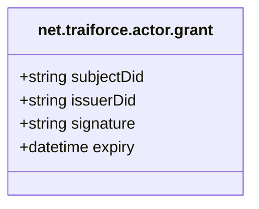
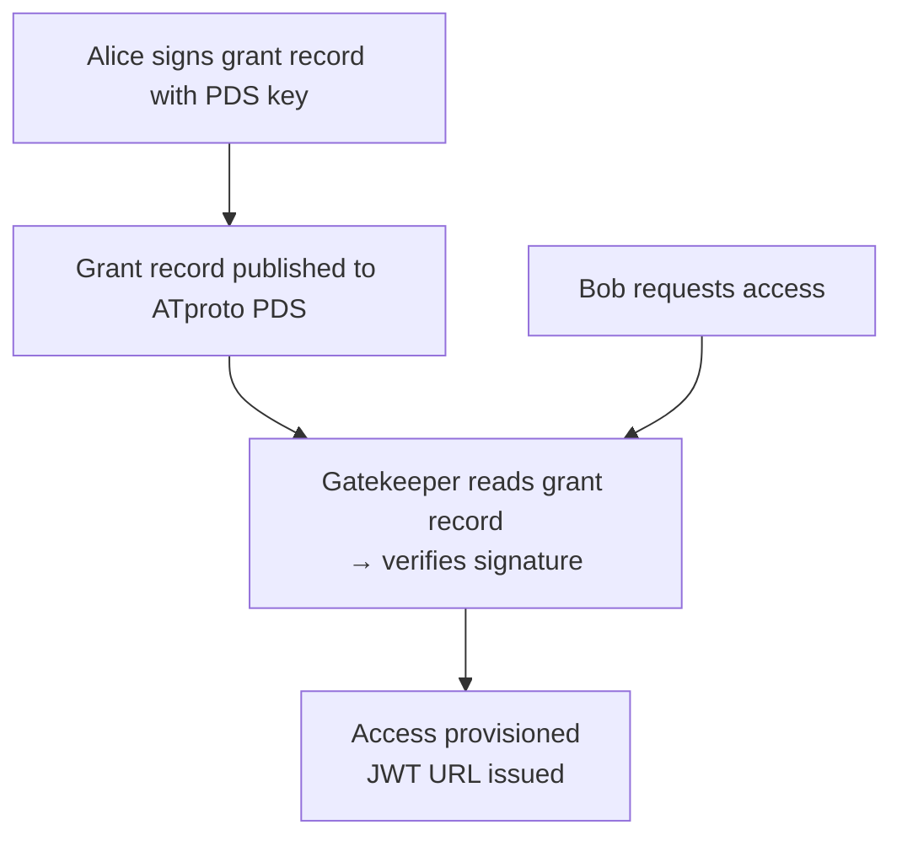
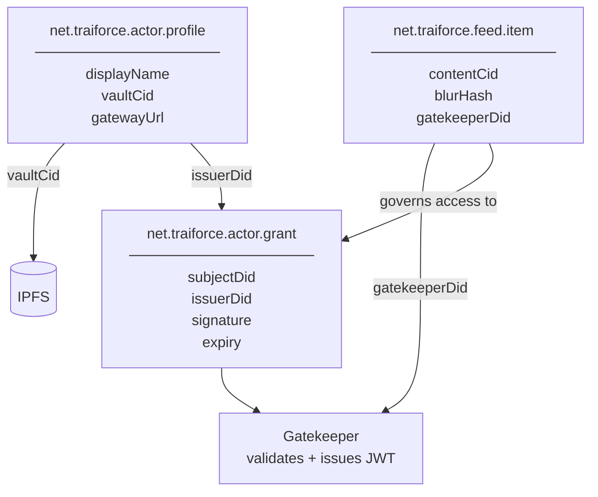

# 02 – Lexicon Specifications

## Core ATproto Lexicon Records

The Traiforce Protocol defines three primary lexicon records in the `net.traiforce` namespace.

---

## A. `net.traiforce.actor.profile`

Defines the user's presence on the Traiforce network.

| Field | Type | Description |
|---|---|---|
| `displayName` | string | Public-facing teaser name visible to all ATproto users |
| `vaultCid` | string | IPFS CID pointing to an encrypted JSON blob of the full profile |
| `gatewayUrl` | string | Address of the user's dedicated Pinata Gateway (e.g., `alice.mypinata.cloud`) |

**Data Flow:**

---

## B. `net.traiforce.feed.item`

The gated content pointer. References an encrypted piece of content on IPFS with a safe preview.

| Field | Type | Description |
|---|---|---|
| `contentCid` | string | IPFS hash of the actual content (encrypted, requires authorization) |
| `blurHash` | string | L×W representation of the image for safe public previews |
| `gatekeeperDid` | string | DID of the Gatekeeper service the client must contact for access |

**Data Flow:**

---

## C. `net.traiforce.actor.grant`

The Access Control List (ACL) entry. Authorizes a specific user to access gated content.

| Field | Type | Description |
|---|---|---|
| `subjectDid` | string | DID of the user being granted access |
| `issuerDid` | string | DID of the content creator issuing the grant |
| `signature` | string | Cryptographic signature from `issuerDid` verifying the grant |
| `expiry` | datetime? | Optional expiration timestamp; checked by Gatekeeper on every session handshake |

**Data Flow:**

---

## Lexicon Relationships

