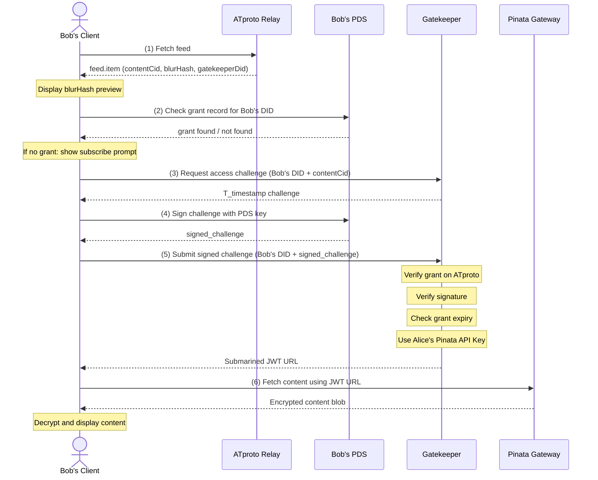
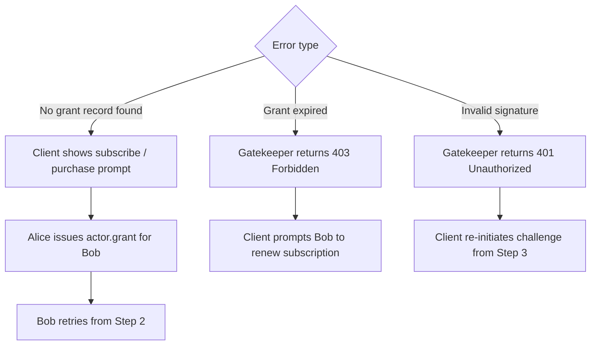

# 03 – Access Workflow

## End-to-End Content Access Sequence

The following diagram shows how a subscriber (Bob) discovers and accesses gated content created by a creator (Alice).

### Participants

| Actor | Role |
|---|---|
| **Alice** | Content creator; owns PDS, Pinata gateway, and Gatekeeper |
| **Bob** | Subscriber; requests access to Alice's gated content |
| **ATproto Relay** | Aggregates and serves ATproto records to clients |
| **Gatekeeper** | Alice's sidecar service; validates grants and issues JWT URLs |
| **Pinata Gateway** | Alice's dedicated IPFS gateway; serves encrypted content |

---

## Sequence Diagram

---

## Step-by-Step Description

### Step 1 – Discovery

Bob's client fetches Alice's `net.traiforce.feed.item` records from the ATproto Relay. Each item contains:
- `contentCid`: the IPFS hash of the actual (encrypted) content
- `blurHash`: a safe, low-fidelity preview image
- `gatekeeperDid`: the DID of Alice's Gatekeeper service

The client renders the `blurHash` as a placeholder while evaluating access.

### Step 2 – Pre-flight Grant Check

Before requesting access, the client checks whether a `net.traiforce.actor.grant` record exists in Alice's PDS for Bob's DID. This avoids unnecessary network calls if no grant has been issued.

### Step 3 – Authentication Challenge

Bob's client contacts the Gatekeeper (identified by `gatekeeperDid`) and requests an access challenge for the desired `contentCid`. The Gatekeeper responds with a `T_timestamp` challenge nonce.

### Step 4 – Identity Proof

Bob's client signs the `T_timestamp` challenge using his PDS key. This proves that Bob controls the DID making the request without revealing the key itself.

### Step 5 – Authorization

The Gatekeeper receives the signed challenge and performs a series of checks:
1. **Grant verification**: Reads Alice's PDS to confirm a valid `net.traiforce.actor.grant` exists for Bob's DID.
2. **Signature verification**: Validates Bob's signed challenge against his published public key.
3. **Expiry check**: If the grant has an `expiry` field, confirms it has not passed.

On success, the Gatekeeper uses Alice's Pinata API Key to generate a **Submarined JWT URL** — a time-limited, authorized URL for the specific `contentCid`.

### Step 6 – Content Provisioning

Bob's client uses the JWT URL to fetch the encrypted content blob from Alice's Pinata Gateway. The client then decrypts the content locally and displays it to Bob.

---

## Error Paths

