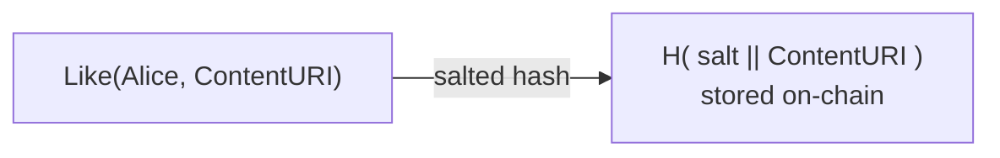
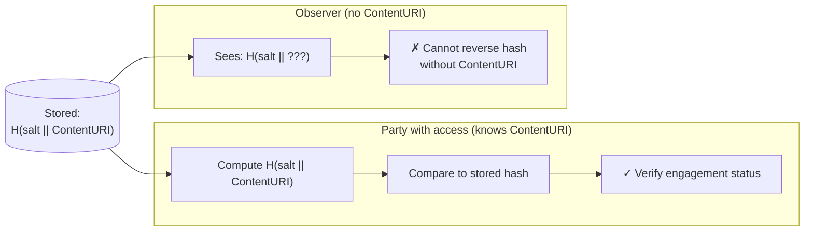
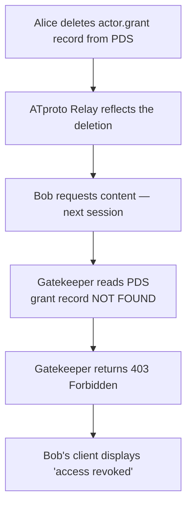
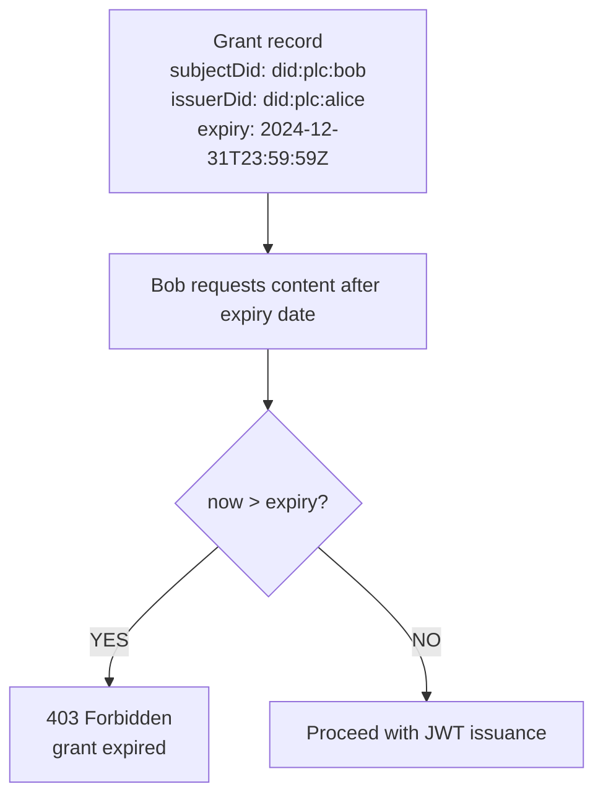
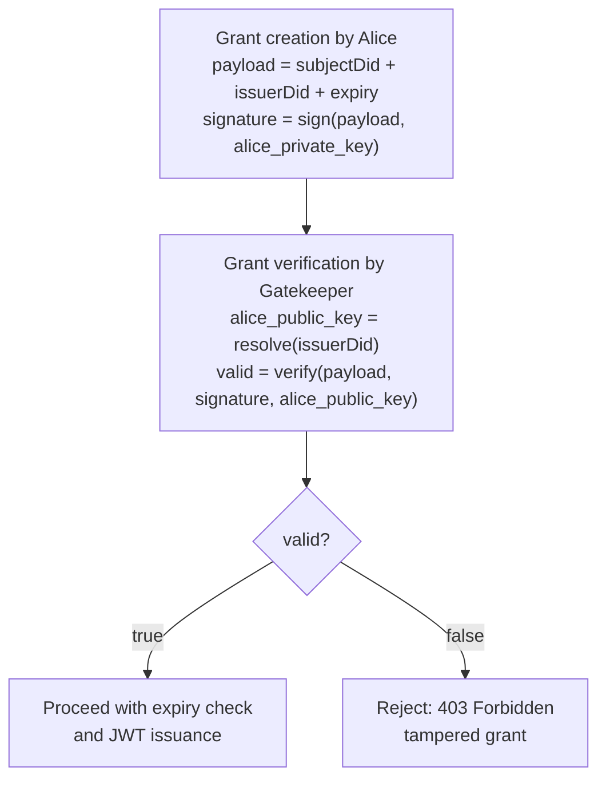
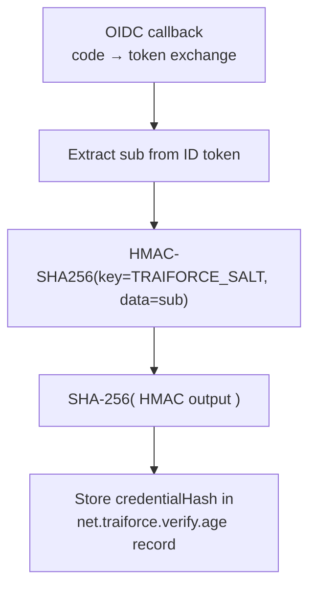
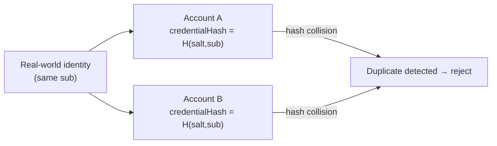

# 04 – Security & Privacy

## Overview

The Traiforce Protocol incorporates security and privacy mechanisms to protect user interactions, enable content revocation, and enforce age gating.

---

## 1. Blinded Interactions

### Problem

In a public social graph, "Like" events can reveal which users have access to which private content. An observer could infer subscription relationships by monitoring engagement signals, even without accessing the content itself.

### Solution: Salted Hash Obfuscation

Traiforce obfuscates engagement metadata by storing a salted hash of the interaction rather than a plaintext reference.



> **Stored as** `H( salt || ContentURI )` where `H` is a cryptographic hash function and `salt` is a secret known only to parties with content access. Observers see an opaque hash and cannot determine which content was liked without already knowing the `ContentURI`.

### Verification Flow



**Security Property**: Only parties who already have access to the `ContentURI` can verify a specific engagement record. This prevents social graph scraping by third parties.

---

## 2. Content Revocation

Traiforce supports two revocation modes: **immediate** and **scheduled**.

### Immediate Revocation



**Behavior**: Access is denied on the **next token request**. Any previously issued JWT URLs remain valid until they expire naturally (short TTL recommended).

### Scheduled Revocation



**Behavior**: The `expiry` field is checked by the Gatekeeper during **every session handshake**, ensuring time-limited subscriptions are automatically enforced without requiring Alice to manually delete grants.

---

## 3. Key Threat Model

| Threat | Mitigation |
|---|---|
| Social graph scraping | Blinded interactions via salted hash obfuscation |
| Unauthorized content access | Grant verification on every token request; Gatekeeper enforces ACL |
| Identity spoofing | T_timestamp challenge + PDS key signature proves DID ownership |
| Stale access after revocation | Immediate: delete grant record; JWT TTL limits blast radius |
| Subscription over-run | `expiry` field enforced by Gatekeeper on every handshake |
| Pinata API key exposure | Key stays on Gatekeeper; clients only receive short-lived JWT URLs |

---

## 4. Cryptographic Signature Verification

The `net.traiforce.actor.grant` record includes an `issuerDid` and a `signature` field. This allows the Gatekeeper to verify that the grant was created by the legitimate content owner and has not been tampered with.



---

## 5. Minor Protection & Age Verification

### Overview

The `net.traiforce.verify.*` lexicons enable age gating without storing any PII on the ATproto PDS.

### Credential Hash Generation

The `credentialHash` field in `net.traiforce.verify.age` is computed by the Hono Gatekeeper during the OIDC callback:

```
credentialHash = SHA-256( HMAC-SHA256(key = TRAIFORCE_SALT, data = provider_sub) )
```

- **`provider_sub`** – the opaque subject identifier from the IAL2 provider's ID token (`sub` claim).
- **`TRAIFORCE_SALT`** – a secret environment variable on the Gatekeeper; never stored in the PDS or client.



### Anti-Sybil Property

Because the same `sub` value combined with the same salt always produces the same hash, the Gatekeeper or AppView can detect when a single real-world identity attempts to verify multiple accounts:



### Blind Verification

The raw `sub` claim is never written to the ATproto PDS. Observers see only an opaque SHA-256 hex string and cannot reverse it to the original identity without knowledge of both the `sub` value and the `TRAIFORCE_SALT`.

| Threat | Mitigation |
|---|---|
| PII exposure on PDS | `credentialHash` stores only a keyed hash; raw `sub` is discarded |
| Multiple accounts per identity | Same `sub` → same hash; duplicates rejected by Gatekeeper |
| Forged attestations | Record is signed by the Gatekeeper's ATproto key; verifiable via `provider`'s public keys |
| Stale verifications | `expiresAt` field enforced on every read; re-verification required periodically |
