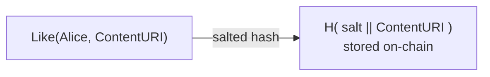
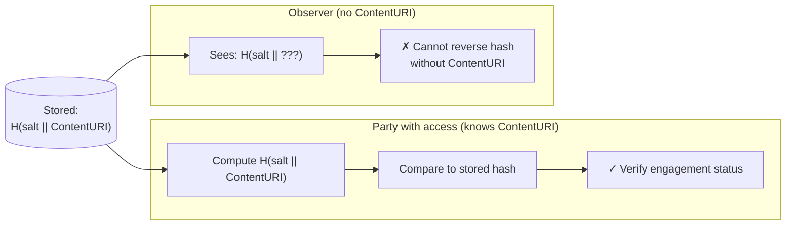
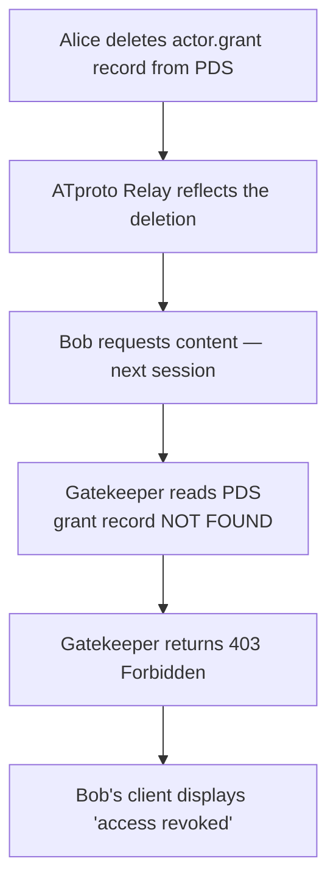
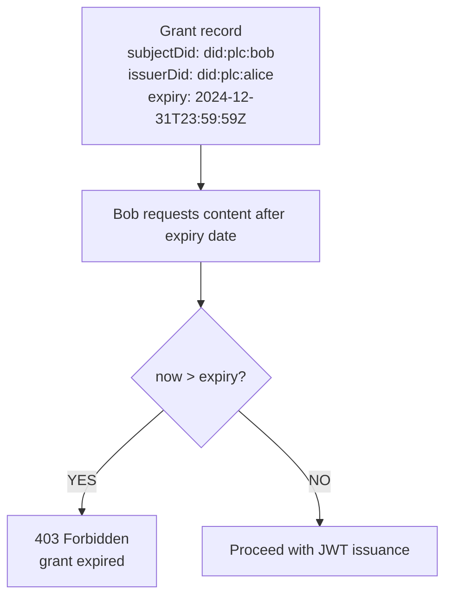
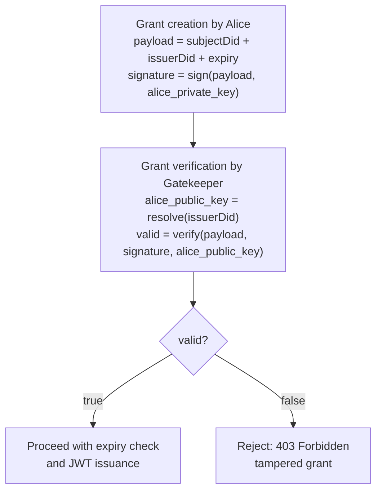

# 04 – Security & Privacy

## Overview

The Traiforce Protocol incorporates two key security and privacy mechanisms to protect user interactions and enable content revocation.

---

## 1. Blinded Interactions

### Problem

In a public social graph, "Like" events can reveal which users have access to which private content. An observer could infer subscription relationships by monitoring engagement signals, even without accessing the content itself.

### Solution: Salted Hash Obfuscation

Traiforce obfuscates engagement metadata by storing a salted hash of the interaction rather than a plaintext reference.

> **Stored as** `H( salt || ContentURI )` where `H` is a cryptographic hash function and `salt` is a secret known only to parties with content access. Observers see an opaque hash and cannot determine which content was liked without already knowing the `ContentURI`.

### Verification Flow

**Security Property**: Only parties who already have access to the `ContentURI` can verify a specific engagement record. This prevents social graph scraping by third parties.

---

## 2. Content Revocation

Traiforce supports two revocation modes: **immediate** and **scheduled**.

### Immediate Revocation

**Behavior**: Access is denied on the **next token request**. Any previously issued JWT URLs remain valid until they expire naturally (short TTL recommended).

### Scheduled Revocation

**Behavior**: The `expiry` field is checked by the Gatekeeper during **every session handshake**, ensuring time-limited subscriptions are automatically enforced without requiring Alice to manually delete grants.

---

## 3. Key Threat Model

| Threat | Mitigation |
|---|---|
| Social graph scraping | Blinded interactions via salted hash obfuscation |
| Unauthorized content access | Grant verification on every token request; Gatekeeper enforces ACL |
| Identity spoofing | T_timestamp challenge + PDS key signature proves DID ownership |
| Stale access after revocation | Immediate: delete grant record; JWT TTL limits blast radius |
| Subscription over-run | `expiry` field enforced by Gatekeeper on every handshake |
| Pinata API key exposure | Key stays on Gatekeeper; clients only receive short-lived JWT URLs |

---

## 4. Cryptographic Signature Verification

The `net.traiforce.actor.grant` record includes an `issuerDid` and a `signature` field. This allows the Gatekeeper to verify that the grant was created by the legitimate content owner and has not been tampered with.

