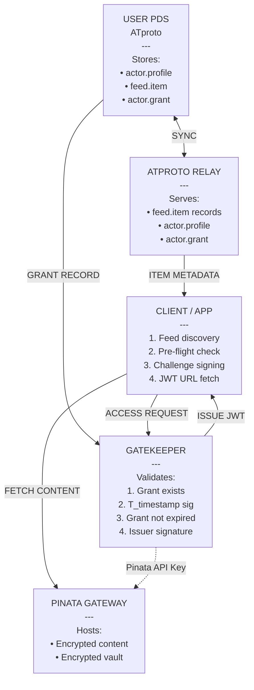
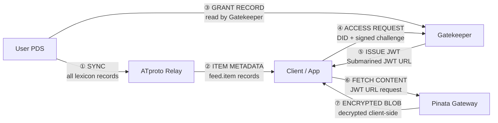
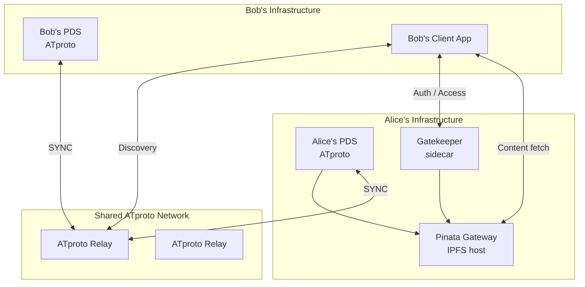

# 05 – System Overview

## High-Level Component Diagram

The following diagram shows all major components of the Traiforce Protocol and their interactions.

---

## Data Flow Summary

---

## Component Responsibilities

| Component | Protocol Role |
|---|---|
| **User PDS** (ATproto) | Source of truth for all lexicon records; controls grant issuance and revocation |
| **ATproto Relay** | Aggregates and indexes PDS records; enables content discovery across network |
| **Client / App** | User interface; orchestrates the full access workflow on behalf of subscriber |
| **Gatekeeper** | Decentralized auth sidecar; validates grants + identity; issues JWT URLs |
| **Pinata Gateway** | IPFS content delivery; enforces JWT-based access control on encrypted blobs |

---

## Deployment Topology

