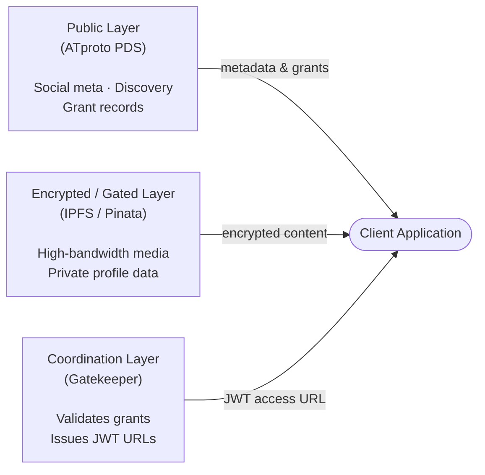

# Traiforce Protocol – Architecture Documentation

This directory contains architecture diagrams and technical specifications for the **Traiforce Protocol**, a decentralized layer for private content built on top of the AT Protocol (ATproto) and IPFS (via Pinata).

## Documents

| Document | Description |
|---|---|
| [01 – Protocol Architecture](./01-protocol-architecture.md) | Tripartite Data Model: Public, Encrypted/Gated, and Coordination layers |
| [02 – Lexicon Specifications](./02-lexicon-specifications.md) | Core ATproto lexicon records (`actor.profile`, `feed.item`, `actor.grant`) |
| [03 – Access Workflow](./03-access-workflow.md) | End-to-end sequence diagram for content discovery and gated access |
| [04 – Security & Privacy](./04-security-privacy.md) | Blinded interactions, salted-hash engagement, and content revocation |
| [05 – System Overview](./05-system-overview.md) | High-level system diagram showing all component interactions |

## Quick Summary

